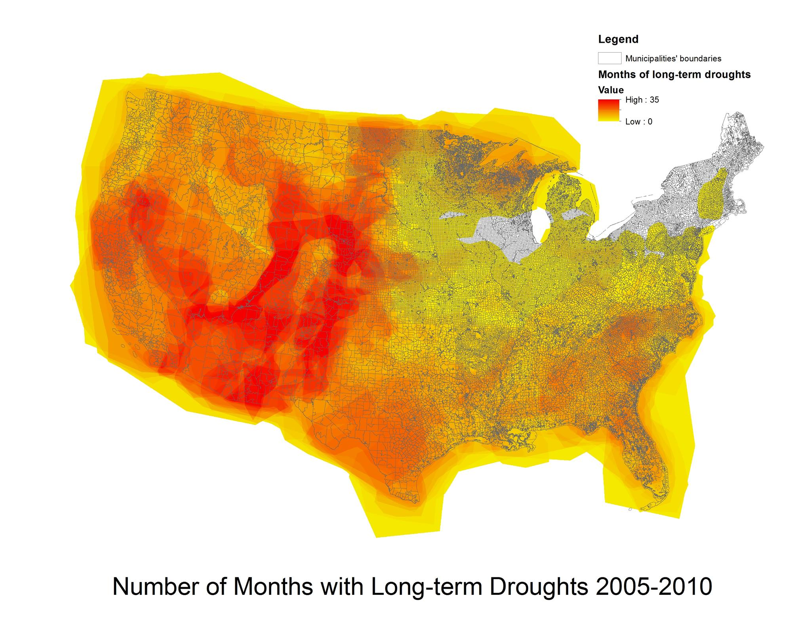
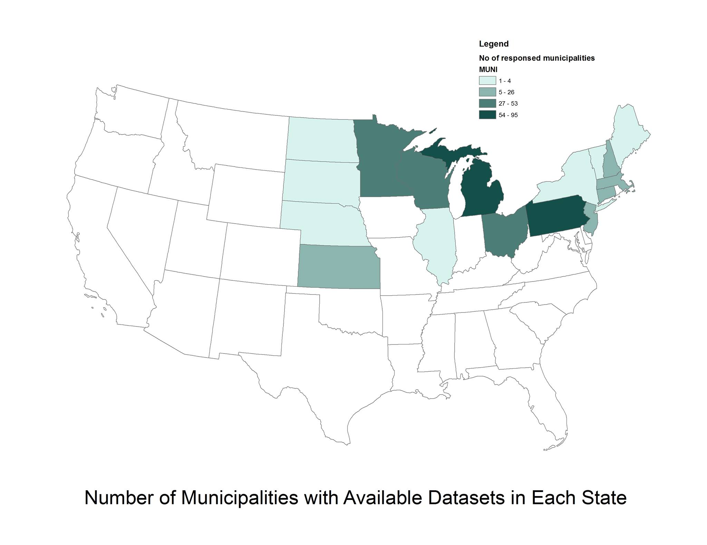

```{r setup, include=FALSE}
knitr::opts_chunk$set(echo = FALSE,warning=FALSE,message=FALSE)
```

```{r load data, results='hide'}
library(sqldf)
library(corrplot)
library(magrittr)
library(highcharter)
library(MASS)
library(data.table)
library(ggplot2)
library(DT)

#control
all_census <- read.csv('all_census_csv.csv',header = TRUE)
some_census <- sqldf("
select
  `GEO.id2` as GEOID,
  cast(Age_median as float) as age_median,
  cast(Pop_total as float) as pop_total,
  100*cast(Pop_male as float) / cast(Pop_total as float) as per_male,
  cast(Ratio_agedepen as float) as ratio_agedepen,
  cast(HH_size as float) as hh_size,
  cast(HH_samesex as float) as hh_samesex,
  cast(HH_OC as float) as hh_oc,
  100* cast(Pop_25to64 as float) / cast(Pop_total as float) as per_25to64,
  100* cast(Edu_bachelor as float) / cast(Pop_total as float) as per_edu_bachelor,
  cast(Income_medianhh as float) as income_median_hh,
  cast(Income_OC as float) / cast(Income_RC as float) as income_oc_to_rc
from all_census")

#independent
agg_percent_flood <- read.csv('agg_percentflood_final.csv',header = TRUE)
drought <- read.csv('drought.csv',header=TRUE)
proximity <- read.csv('proximity.csv',header = TRUE)


#dependent
sustain <- read.csv('sustain.csv',header = TRUE)

final_df <- sqldf("
select
  B.STATEFP,
  B.ST_FIP,
  A.GEOID,
  C.q1a,
  C.q1d,
  C.q6,
  C.q6c,
  A.age_median,
  A.pop_total,
  A.per_male,
  A.ratio_agedepen,
  A.hh_size,
  A.hh_samesex,
  A.hh_oc,
  A.per_25to64,
  A.per_edu_bachelor,
  A.income_median_hh,
  A.income_oc_to_rc,
  100*B.Percentflood as percent_flood,
  D.`weighted.avg.mo` as avg_month_drought,
  E.NEAR_DIST as near_dist
from some_census A
inner join agg_percent_flood B
 on A.GEOID = B.GEOID
inner join sustain C
 on B.ST_FIP = C.ST_FIP
inner join drought D
 on C.ST_FIP = D.ST_FIP
inner join proximity E
 on A.GEOID = E.GEOID")

final_df <- final_df[complete.cases(final_df),]

final_df$pop_total <- final_df$pop_total/1000
final_df$income_median_hh <- final_df$income_median_hh/1000
final_df$near_dist <- final_df$near_dist/1000

final_df$q1a <- factor(final_df$q1a,levels=1:4,ordered=TRUE)
final_df$q6<- ifelse(final_df$q6==1,1,0)
final_df$q1d <- factor(final_df$q1d,levels=1:4,ordered=TRUE)
final_df$q6 <- factor(final_df$q6,levels=0:1,ordered = TRUE)
final_df$q6c <- factor(final_df$q6c,levels=0:1,ordered = TRUE)
write.csv(final_df,'final_df.csv',row.names = FALSE)
```

# Abstract

Climate change, one of the biggest issue for the 21st century in the United States, affects humans and environment in many ways including water resources - greater precipitation, faster evaporation, and earlier snowmelt, and sea level rise. These effects have led to floods and droughts in many regions of the country.

US efforts with climate change priorities are, instead of top-down, bottom-up. On the federal level, policies on environmental issues are highly dependent to politics and less progressive compared to European countries’. US government has refused to sign international treaties on environmental issues, for instance Kyoto Protocol and Paris Climate Agreement to reduce greenhouse gas emissions. To deal with water and related hazard issues, Clean Water Act (CWA) 1972 is a federal approach to alleviate the problems. However, with limitations on nonpoint source pollution addressing, and cost and technology requirements, the regulation is not totally efficient to deal with floods and droughts.

Local governments play an important role to alleviate climate change problem such as GHG emission reduction policies, Climate Action Partnership (CAP), Cities for Climate Protection (CCP) participation, and other local strategies. Green infrastructure is a part of local initiatives to reduce hydrological hazards such as floods and droughts, and improve water quality. It provides a variety of practices ranged from rain garden, bio-retention pond, and impervious surface limits. 

Impervious surface, changing drainage pattern of storm water, is a part of hydrological-related hazard strains in the local level. Impervious surface limitation policy is believed to be a solution of flood and drought issues. From ICMA 2010 Sustainability Survey, approximately 650 local governments have set impervious surface limits on private properties. The research aims to find relationships between climate change’s effects on water resources and local governments’ impervious surface policies if floods and droughts have positive relationship to impervious surface adoption.

# Introduction - Effects of climate change to water resources in the US

Climate change has become one of the biggest issue for the 21st century. For the United States, climate change has impacts on many aspects including water resources. From **EPA’s report**, Potential Effects of Global Climate Change in the United States **(1986)**, because of higher temperature, there will be greater precipitation, faster evaporation, and earlier snowmelt. These will cause floods, spatial distribution change of drought, and significantly less water availability in regions, especially in arid areas **(Numec, 1985 and Beran, 1986)**.

By water resource regions, the West and California regions are warmer and drier with severely less water supply in rivers. The issue is similar to Colorado, Rio Grande, and Great Basins, **Stockton and Boggess (1979)** states that if the temperature increases by 2%, there will be 10% less precipitation, 40% and 76% less water supply in Colorado and Rio Grande respectively. Also, in the Southeast region, inflow in rivers have become drier.

While regions are facing drought problems, some regions such as Pacific Northwest, Northeast, and Southeast will be more prone to sea level rises and floods. Great Lake region is highly uncertain. Higher temperature may increase precipitation or evaporation making the water level in the lakes lower.

## Water resource policies and actions from federal and state level

To deal with water resource issues on the federal level, Flood Control Act of 1930 is the first effort to work with flooding. The bill, more focused on structural approach, supports floodwall, levee, and fill structures. It also includes gully control, soil conservation, modified cropping practices, revegetation, and slope stabilization. On the other side, limitations of the approach are over-capacity flooding problems, narrowed channels from levee and dam structures, false sense of security of the public, higher financial costs, and adverse impact of flood control structures **(Brody et al., 2009)**.

Clean Water Act (CWA) 1972 is another tool for water pollution control. Regulated by US EPA, large storm water dischargers such as industrial facilities are required to obtain a permit under National Pollutant Discharge Elimination System (NPDES). However, NPDES has not covered storm water runoff from buildings, parking lots, and driveways which are difficult to define as point source pollution until the act amendment in 1987. The amendment provides a provision to manage nonpoint source pollution which is “man-made” or “man-induced”. The other CWA mechanism is Total Maximum Daily Loads (TMDLs) which define maximum amount of pollutants that a water body can receive while maintaining water quality standards. However, TMDL does not include storm water quantity control. According to Virginia Department of Transportation v United States Environmental Protection Agency, 2013, a federal court stated that storm water runoff is not a pollutant and cannot be regulate under TMDL standards **(Dhakal, 2015)**.

**Dhakal (2015)** states 4 challenges of CWA for a city – cost and technology requirements, no regulation on private properties which make up to 65-75% of total lands, no funding for storm water management which is not point source pollution, and less focus on restoring landscape ecology.

These days, flood mitigation trend is shifting from structural to non-structural approach such as National Flood Insurance Program (NFIP), fiscal strategies to dedicate funding for flood mitigation programs, Community Block Grant Program to allocate federal funds to local flood mitigation initiatives, and impervious surface policies to maintain hydrological systems **(Brody et al., 2009)**.

On state level, State’s regulations are a major factor making local governments to adopt non-structural flood mitigation approaches. Meanwhile, floodplain areas are not an obvious indicator of having flood mitigation strategies, both structural and non-structural, because of financial burdens on structural costs for dams and levy constructions **(Brody et al., 2009)**.

Compared to federal level enforcement, cities play more important role in controlling storm water. US big cities such as Chicago, Philadelphia, Portland establish LID tools and programs to encourage more green infrastructure. Even there are regulations and policies on storm water management on city level, incentives and mechanisms are not efficient to encourage private landowners **(Dhakal, 2015)** which make up 65-75% if a city area **(Ruhl et al., 2007)**. US cities need to encourage more private properties to adopt LID through incentives such as storm water fee, fee discount, and other development incentives. Dhakal suggests that fees are needed to cover total costs of storm water and LID with its benefits to ecology and society as a whole.

## Local actions toward climate change and related policies

**Enkel (2006)** pointed that US efforts with climate change priorities are, instead of top-down, bottom-up.

Starting from local level, many local communities have adopted their environmental policies after the 2008 US Conference of Mayors to reduce gas emission as a substitute of the absence of strong federal actions under Bush administration. 850 communities signed Climate Change Protection Agreement following European countries’ guidelines instead of Washington DC **(Schreurs, 2008)**. Mega cities – Chicago, Houston, Austin, New Orleans, Los Angeles, San Francisco, Portland, Seattle, New York, Washington DC, and Philadelphia have joined C40 networks which are created to facilitate dialogue between officials for climate change issues including water management.

Local initiatives on environmental issues can also have an effect beyond its boundaries. The most obvious example is California and local air pollution control policies which later became federal regulations for all states to follow. In 1941, Los Angeles has established Air Pollution Control District, the first place in the US. The policy had encouraged the state of California to adopt the first statewide air quality standards for motor vehicles for total suspended particulates in 1959. Finally, federal tailpipe emission standards, led by California, were introduced to all other states in 1966. “California Effect” is a term coined by David Vogel, a professor in Business Ethics at University of Berkeley, to explain the ability of local government to set trends on environmental policies beyond its own boundaries.

The other efforts of local municipalities to initiate climate change is adopting Cities for Climate Protection (CCP) program, an international local government network to reduce gas emission. In the US, 159 local municipalities have adopted the programs. **Brody (2008)** found that counties located along the coastal areas, defined by over 15% of area within coastal watershed, which have higher risks of natural hazards– Northeast, Pacific Northwest, California, Great Lakes, and Gulf Coast regions are more likely to adopt CCP program by 3.8 times higher than average. Another important factor is casualties from hydrological hazards such as floods, hurricanes, storms, and droughts, making counties to adopt CCP more by 36%. Higher solar energy use, college educated, and existence of environmental non-profits are supportive to a municipalities more capable to join CCP.

However, state and federal governments are still important factors for local governments to adopt climate change policies. From 2 traditional models for understanding policy innovation – internal determinant, and regional diffusion model, **Basset & Shandas (2010)** suggests that policy innovation at state level can create regional diffusion on local level. Only 15% of ICLEI members had implemented climate action plans in 2010 because many municipalities struggle with data, technical analyses, and experience with climate change, especially for small municipalities which need local plans at the same scale to study before developing their own rules.

## Impervious surface and climate change

Impervious surfaces have become an important factor for storm water management under climate change strains. Urbanization, growing quickly since the last century, is the major cause of impervious surface increase which ledto water pollutions and higher volume of runoff. Climate change amplifies these effects **(Gill et al., 2007)** as it causes more severe and frequent floods.

## Impervious surface and flooding

To deal with runoff and flooding, Low Impact Development (LID) or Green Infrastructure (GI) which include impervious surface disconnection is an approach invented to improve water quality, flood control, air purification, micro and macro inhabitants, and scenic beauty **(Foster, Lowe, and Winkelman, 2011)**. The approach covers both structural and nonstructural strategies which nowadays flood management are more focused on non-structural such as land use policies, and flood mapping instead of structural infrastructure **(Gill et al., 2007)**. Impervious surface reduction is also a non-structural effort to mitigate hydrological hazards in different levels of administration including local government. It has been found that urbanization and land use are significantly related to flooding and droughts, especially frequent flood magnitudes in the small-scale areas. One of the most obvious effect of urbanization is impervious surface which decrease infiltration capacity and increase volume of runoff and frequency of flooding **(Tollan, 2002)**. From **Gill et al. (2007)** research on green space and infrastructure using Manchester, UK as a case study, adding 10% green cover in the residential areas will reduce runoff by 28 mm precipitation or 4.9-5.7% runoff by 2080. Even the reduced runoff volume is not high compared to the whole area, impervious surface policy in local municipalities is another option to work along with other green infrastructure strategies to reduce runoff and flood risks.

Organization capacity such as ability to participate, make decisions, and adjust policies is a critical factor to have stronger non-structural policies **(Brody, 2009)**. In this thesis, organizational capacity is measured by level of priority a municipality gives to climate change policies, ranged from not a priority at all to highest priority.

Impervious surface reduction is an approach that can be enforced in all levels of administration **(Arnold, 1996)**, from federal and state to local level which can be both on public and private spaces. For private spaces, governmental approaches are created to encourage less impervious surfaces such as strict limitation and impact fee. Strict limits set the maximum percentage of impervious surfaces. For instance, Brunswick, Maine, designates “coastal zone” along Maquoit Bay and maximum impervious surface covers at 5% by lot size. The other governmental approach is Impact fee uses technical models to predict the volume of runoff from a land lot. The fees are collected from treatment costs for the runoff **(Arnold, 1996)**. Also for local scale, impervious surface is feasible to achieve compared to other climate change actions. **Basset & Shandas (2010)** states that the most common local government actions are weatherization of existing buildings, adopting green infrastructure, and improving fleet efficiency while the most difficult one is addressing climate change and adaptation plan. Only large cities have discussions and strategies.

In terms of application of impervious surface reduction in private sites, site planning is a technique to achieve the goal. For example, road hierarchies, reducing 32-foot to 20-foot width based on the intensity of use, can reduce impervious surfaces by 6% while cluster development, grouping houses on a site and conserving a shared natural space, can reduce imperviousness by 10-50% **(Schuler, 1994)**.

# Research questions and hypotheses

Research questions can be divided into 2 major points – Local government’s priorities toward environment and climate change, and impervious surface policy adoption, effects of climate change and impervious surface policy adoption.

## To what extent climate change make local municipalities gives their priorities to environment and climate change?

The paper aims to study about the relationship between effects of climate change and local municipalities’ priorities toward environment and climate change.

**Hypothesis**: Municipalities with flood or drought issues shall give higher priority to climate change policies compared to the other municipalities.

## To what extent climate change make local municipalities adopt impervious surface policies? Is flood one of factors making municipalities adopt impervious surface policies?

The research picked this question to see the relationship between impervious surface policies and flooding. Flooding is one of the strongest motivation to adopt the policies as it is found to be more frequent and severe if percentage of impervious surface to total area is higher. Vice versa, impervious surface disconnection can help reducing runoff, flood control, and water pollution problems.

**Brody et al. (2009)** pointed that flood experiences encourage flood mitigation approaches in different ways. Current damaging flood events encourage structural approaches while repetitive flood loss drives non-structural ones.

**Hypothesis**: Flood-prone municipalities shall adopt stricter impervious surface policies compared to the other municipalities which stricter means the local government is responsible for water services, set limits on impervious surfaces on private properties.

## Is drought one of factors making municipalities adopt impervious surface policies?

Even a relationship between droughts and impervious surface policies are not strong as flooding, impervious surfaces lead to decrease in evaporative cooling. During a dry period, grass will dry out faster **(Gill et al., 2007)**. The research picked this question to see the relationship between impervious surface policies and droughts.

**Hypothesis**: Drought-prone municipalities shall adopt stricter impervious surface policies compared to the other municipalities.

## Is there any relationship between climate change and impervious surface policies?

From ICMA 2010 Sustainability Survey, 5.2% and 46.3% of responded municipalities stated that environment and climate change are not a priority respectively. The numbers show that environmental issues are more recognized compared to climate change. Meanwhile, 30.3% of local municipalities have adopted impervious surface policies on private properties. The paper aims to see if impervious surface policy adoption is related to levels of priorities given to environmental issues or climate change.

**Hypothesis**: Municipalities with a priority on climate change issue shall adopt impervious surface policies on private properties more compared to the other.

## Is proximity to surface water bodies one of factors making municipalities adopt impervious surface policies?

A county with 15% or more area within coastal watershed is 3.8 times more likely to adopt climate change policies than average **(Brody et al.,2008)**. The research picked this

question to see the relationship between if local governments’ motivation from proximity to surface water bodies also apply to impervious surface policies.

**Hypothesis**: The municipalities located next to surface water bodies shall adopt higher standard of impervious surface policies compared to the other municipalities.

# Methodology

## Data

Area of study will be the contiguous US, 48 states except Alaska and Hawaii. Unit of calculation is a municipality or county subdivision.

To see if there is a relationship between climate-change-related hazards and municipalities’ willingness to adopt impervious surface policies, the research uses three methodologies – logistic regression, ordinal logistic regression, and T-Test, with selected variables: FEMA Flood Hazard Areas and US Drought Monitor results as independent variables, ICMA 2010 Sustainability Survey results as dependent variables, and socioeconomic statistics from US Census as control variables.

### Floods

FEMA Flood Hazard Areas are used to represent flood-proneness of a municipality. To quantify flood risks, a percentage of high flood-risk area to total area without open water of a municipality is used as an independent variable `percent_flood` (unit: %).

### Drought

US Drought Monitor results, using Standardized Precipitation Index (SPI), are used to see if a municipality is prone to long-term drought, also called Hydrological Impact before 2010, which is an area under abnormally dry condition or worse, code D0 to D4 in the dataset, longer than 6 months. The long-term drought data is weekly, the research uses the first week of a month between 2005 – 2010 for analyses.

To quantify the magnitude of drought, drought layers of the first week of every month from 2005 to 2010 are overlaid to see how many months from 72 months in total that a municipality faced long-term drought. It is transformed into variable `avg_month_drought` (unit: months).

### ICMA Sustainability Survey

ICMA 2010 Sustainability Survey results from 8,569 municipalities with population 5,000 or greater. Response rate is 25.4% or 2,176 local governments. Selected question from the survey are `q1a`, `q1d`, `q6`, and `q6c`:

* Question 1a – Environment is the following a priority in your jurisdiction. 4-level Likert Scale from 1 (not priority) to 4 (highest priority), use ordered logistic regression

* Question 1d – Climate change is the following a priority in your jurisdiction. 4-level Likert Scale from 1 (not priority) to 4 (highest priority), use ordered logistic regression

* Question 6 – Is your local government responsible for water service? Yes/no format, 0 for not responsibility and 1 for responsibility, use logistic regression.

* Question 6c – Local government sets limits on impervious surfaces on private properties? Yes/no format, 0 for no and 1 for yes, use logistic regression.

Municipalities without response of these questions will be removed before calculation. Thus, there will be 422 municipalities in 17 states in total.

### Proximity to water sources

`near_dist` (unit: kilometers)

### Socioeconomic control variables

Control variables are compiled from US Census, American Community Survey (ACS) 2010, 5-year estimates, County Subdivision unit. The dataset references are:

* B01002 MEDIAN AGE BY SEX

* S0101 AGE AND SEX

* S1101 HOUSEHOLDS AND FAMILIES

* S2301 EMPLOYMENT STATUS

* S2503 FINANCIAL CHARACTERISTICS

Due to Baptiste et al. (2015)’s research on willingness to adopt green infrastructure in Syracuse, New York, factors that had influence on a person’s willingness to adopt green infrastructure such as a rain garden are efficacy, aesthetics, cost of installation, health, and ecological values respectively. The other important factors are gender, and green infrastructure knowledge of residents. Hispanics have highest efficacy with implementation of green infrastructure compared to other ethnic groups.

The selected variables and abbreviations used in the analyses are:

* `Age_median`: Median age (unit:years)

* `Pop_total`: Total population (unit:1,000 people)

* `Per_male`: Ratio of male to female (unit: %)

* `Ratio_agedependen`: Ratio of age dependency (unit: %)

* `Hh_size`: Average household size (unit: people)

* `Hh_samesex`: Number of household with same-sex couple (unit: households)

* `Hh_OC`: Household’s owner occupied rate (unit: %)

* `Per_25to64`: Percent of population of age 25 to 64 (unit: %)

* `Per_edu_bachelor`: Percent of population with bachelor degree of higher (unit: %)

* `Income_median_hh`: Median income by household (unit: 1,000 USD)

* `Income_oc_to_rc`: Ratio of owner occupied household to renter occupied household’s median income (unit: times)

## Data Processing

### Prepare flood hazard layer

  * Convert to raster – Cell size = 10 meters X 10 meters except California, Florida, and Texas which are 20 meters X 20 meters due to complex polygon issue, Cell Assignment Type = Maximum Area, Value field = FLD_ZONE,
  
  * Project – NAD 1983 (2011) Contiguous USA Albers Equal Area
  
  * Products are projected raster layers of 48 states

### Extract water bodies from calculation

* Layers needed for this step are US County layer and ESRI hydrology layer (USA National Atlas Water Feature Areas and ESRI Detailed Water)

* Use ESRI hydrology layer to extract water body areas out of US County layer using Erase Tool (Analysis Tools > Overlay > Erase)

* Use US County layer, now without water body areas, to clip water bodies out of the flood hazard raster layers using Extract by Mask tool (Spatial Analyst Tools > Extraction > Extract by Mask)

* Products are projected raster layers without water bodies of 48 states

### Prepare drought area layer

* Import all drought layers from 2006 – 2010 into GIS.

* Add a column named ‘Drought’ (short integer, precision = 1) to all layers’ attribute tables

* Assign value 1 to all polygons’ Drought column for all layers. The value will be used as a dummy for drought frequency

* Union (Join Attributes - NO FID, No gap allowed). There will be multiple Drought columns i.e. Drought, Drought_1, Drought_2, Drought_3, and so on.

* (Optional) Clear all other fields, except county ID and drought columns, out using Delete Field Tool (Data Management > Field Tools > Delete Field).

* Add a new column named ‘Score’ to the new layer. Calculate the total number of droughts by summing up all drought columns. The final number is the number of droughts from 2006 – 2010 in that area.

* Product is a layer representing boundaries and frequency of long-term drought areas between 2006 and 2010.

### Prepare municipality boundary layer

* Use TIGER’s census shapefile, county subdivision unit of all states

* Project – NAD 1983 (2011) Contiguous USA Albers Equal Area. Batch Projection Tool is useful for this step.

* Products are projected municipality layers of all 48 states

* Extract water bodies from municipality boundary layers by using Erase Tool (Analysis Tools > Overlay > Erase) to clip ESRI hydrology layer (USA National Atlas Water Feature Areas and ESRI Detailed Water) from the municipality boundary layer

### Calculate municipality areas

* Use projected municipality boundary layers

* Merge layers together for easier calculation using Merge Tool – Data Management > General Toolset > Merge

* Calculate geometry of the layer, export the table as .dbf format

### Calculate Flood Hazard Areas

* Calculate flood hazard areas within a municipality’s boundaries – Spatial Analyst > Zonal > Tabulate Area

* Zone – Municipality boundary layer

* Zone field – County Subdivision ID (COUSUBFP)

* Class – Flood hazard area layer

* Class field – flood zone (FLD_ZONE)

* A result will be in table format, the unit of flood zone is the number of cells multiplied by cell size (10 X 10 meters, or 20X20 meters for Texas and Florida). The unit is in square meter.

* Export table as .dbf format

* Consolidate flood hazard tables of 48 states into one file. Select only high risk area (Code A and V), and use SUM function in Excel to find total high risk areas. Add a column called State Code to all tables before merging them together.

* The total n is 35,415 municipalities.

### Calculate Drought Areas

* Convert drought frequency layer from step 3 to Raster – Cell size = 1000 meters X 1000 meters, Value field = Score, Cell Assignment Type = CELL_CENTER, Priority field = none,

* Calculate drought areas within a municipality’s boundaries – Spatial Analyst > Zonal > Tabulate Area

* Zone – Municipality boundary layer

* Zone field – GEOID (GEOID)

* GEOID is used, instead of County Subdivision FIP unlike flood data, because the calculation is done 48 states at one time, there will be repetitive FIP

* Class – drought frequency layer

* Class field – drought frequency area (VALUE)

* Product is a table of municipalities’ areas of drought frequency in square meter. The frequency ranges 0-35 from 72 months in total. In the spreadsheet, there are 35 columns of months represent an area in square meter of each municipality. A higher number implies greater severeness of droughts in a municipality. Export the table as database (.dbf) table.

### Find average number of months for each municipality.

* Use the product from step 7 to calculate.

* The original numbers are area in square meter. Convert them into percentage of total area.

* Use weighted average to find average months of long-term drought of each municipality. Create a new column called ‘weighted average month’ use Excel formula:

* =SUMPRODUCT($B$2:$AK$2,$B$3:$AK$3)

### Join 2 tables together to calculate a percentage of flood hazard area of a municipality

* County Subdivision FIP codes will be used to do further analyses as they are consistent with the ICMA Survey’s dataset

* Some FIP codes are repetitive between different states, assign state code with the FIP code. In this paper, CONCATENATE function in Excel is used for combining state code and FIP code to create identical code for all municipalities temporarily.

* For the municipality area table, some municipalities have more than one contiguous area which ArcGIS calculate them as different polygons with the same FIP code. Use Consolidate function in Excel (Data > Consolidate) to sum up the total areas of these municipalities. In this paper, R scripting is used for time efficiency.

* Join 2 tables together

* Calculate the percentages of flood plains. Few municipalities such as Town of Wayne, Michigan, has 101% flood plain to total area which are caused by small differences of vector and raster calculations.

* Product is a table of municipalities’ flood plain area percentage.

### Join the municipalities’ flood and drought tables with the survey table

* Join 2 tables together by FIP code and State Code

* Use only municipalities which have both survey and FEMA flood hazard results

* The total n is 422 municipalities.

### Find proximity to open waters (major lakes and oceans)

* Find municipality's centroid. Use Feature to point tool - Data Management Tool > Features Toolset > Feature to Point.

* Find major lakes and oceans' coastal lines. Use Feature to line tool - Data Management Tool > Features Toolset > Feature to Line.

* Use Near Tool (Analysis Toolbox > Proximity Toolset > Near) to find the shortest distance between municipalities' centroid and coastal lines.

* Export the table as .dbf file

### Problems found

* Data in some states is not available for all counties, e.g. Idaho, Montana, Utah, Alaska.

* Data in some municipalities and counties, e.g. Idaho, is not available for all areas within the boundaries.


## Models

To answer the research questions, the regression models are formulated as follows, with different sets of variables:

$$ 
Y = \beta_0 + \beta_1X_1 + \beta_2X_2 + \beta_3X_3 + \beta_4X_4 + \beta_5X_5 + \beta_6X_6 + \beta_7X_7 + \beta_8X_8 + \beta_9X_9 + \beta_10X_10 + \beta_11X_11 + e
$$

All research questions have the same set of control variables namely:

**Control Variables: **

$X_3$: total population

$X_4$: median age

$X_5$: ratio of male to female

$X_6$: ratio of age dependency

$X_7$: average household siz

$X_8$: number of household with same-sex couple

$X_9$: household’s owner occupied rate

$X_{10}$: median income

$X_{11}$: ratio of owner occupied household to renter occupied household’s median income

### Research question 1

**Dependent Variables: **

From the ICMA Sustainability Survey, our dependent variables ($Y$) are answers to:

* Question 1a – Environment is the following a priority in your jurisdiction, ranges from 1 (not priority) to 4 (highest priority), use ordinal logistic regression

* Question 1d – Climate change is the following a priority in your jurisdiction, ranges from 1 (not priority) to 4 (highest priority), use ordinal logistic regression

**Independent Variables: **

$X_1$: percentage of flood area

$X_2$: percentage of long-term drought area

### Research question 2 and 3

**Dependent Variable: **

From the ICMA Sustainability Survey, our dependent variables ($Y$) are answers to:

* Question 6 – Is your local government responsible for water service? 0 for not responsibility and 1 for responsibility, use logistic regression.

* Question 6c – Local government sets limits on impervious surfaces on private properties, 0 for no and 1 for yes, use logistic regression.

**Independent Variables: **

$X_1$: percentage of flood area

$X_2$: percentage of long-term drought area

### Research question 4

**Dependent Variable: **

From the ICMA Sustainability Survey, our dependent variable ($Y$) is the answer to:

* Question 6c – Local government sets limits on impervious surfaces on private properties, 0 for no and 1 for yes, use logistic regression.

**Independent Variables: **


$X_1$: priority to environment

$X_2$: priority to climate change

### Research question 5

**Dependent Variable: **

From the ICMA Sustainability Survey, our dependent variable ($Y$) is the answer to:

* Question 6c – Local government sets limits on impervious surfaces on private properties, 0 for no and 1 for yes, use logistic regression.

**Independent Variables: **

$X_1$: proximity to surface water bodies

$X_2$: None (=0)

# Results

## Exploratory Data Analysis

### Geospatial

#### Sustainability Survey Distribution

Survey results are available in 17 states – Connecticut, Illinois, Kansas, Maine, Massachusetts, Michigan, Minnesota, Nebraska, New Hampshire, New Jersey, New York, North Dakota, Ohio, Pennsylvania, South Dakota, Vermont, and Wisconsin; mostly in the East Coast and the Midwestern states. There is no result from the West Coast and the South.

Response distribution of each question will be discussed respectively.

##### Question 1a

Most of all municipalities set their priorities for environmental issues. 19% give the highest priority to the issues. Only 5% of respondents, located in the north of Minnesota and southern part of Chicago metro area, state that environment is not a priority at all.


##### Question 1d

Almost a half (48.6%) of all respondents state that climate change is not their priority at all. Compared to Question 1a, only 2% of all municipalities give the highest priority to climate change. There is no spatial trend found among all responses.


##### Question 6

65% of all municipalities are responsible for local water services. By state, Michigan and Minnesota has a good number of water providing municipalities, such as Detroit, Flint, Grand Rapids, and Twin Cities, compared to others. For Pennsylvania, Philadelphia provides water services to residents while Pittsburgh does not. For New York, a part of Long Island Borough is not responsible of the service, surprisingly. For Ohio, the services in Cincinnati metro area are up to the municipalities. Kansas City, MO, also pThere is no specific trend in Maine, Vermont, and New Hampshire.


##### Question 6c

39% of all municipalities have set their impervious surface limits on private properties. Most of them are located in urban areas i.e. Twin Cities, Detroit, Philadelphia, Pittsburgh, a part of Cincinnati, and other municipalities in New Hampshire, Vermont, and Maine.


#### Proximity to Major Open Waters (Lakes and Oceans)

Average distance to major open waters of all studied municipalities is _ m. _ % of municipalities located within ___ miles from the waters. Compared to the whole US's average distance, _ m , the studied municipalities locate significantly closer to the waters.


#### Flood Distribution

From the map below, red and dark blue colors indicate high flood-risks defined by FEMA. Flood plains are highly concentrated along Pacific Ocean, Chesapeake Bay, Florida’s coastal lines, Mississippi River, and Missouri River. By regions, municipalities in the Southern states such as Texas, Louisiana, Alabama, Mississippi, Georgia and Florida have higher percentage of flood-risk areas. Other areas, such as in the Mountain and the Appalachian regions, have smaller and more scattered flood plains.

Coastal and Storm related flood-risk areas have fewer areas compared to other high flood-risk areas. Most of them can be found along the East Coast.


#### Drought Distribution

Long-term droughts are highly concentrated in the Mountain region. The South also has longer drought periods compared to the East Coast and the Midwest. A municipality with the most severe drought problem, located in New Mexico, has 35 months of long-term droughts from 72 in total. However, around 90% of the contiguous US had faced at least 1 long-term drought during the time period, except only parts of the East Coast and Chicago Metro area. Average months of long-term droughts for all municipalities is 5.04 months.



### Quantitative

#### Descriptive Statisitcs

After combining the flood percetage data with the US census and the survey data, we have a dataset of 422 municipalities with the following descriptive statistics.

```{r}
descript <- final_df[,4:21]

summary(descript)

descript$id_var <- 1
descript_m <- melt(descript,id='id_var')
descript_m <- subset(descript_m,select=-c(id_var))
descript_m$value <- as.numeric(descript_m$value )

ggplot(descript_m,aes(x=value)) + geom_histogram() + 
  facet_wrap(~variable,scales=c('free'))
```

The data is available in 17 states, the numbers in parentheses are number of municipalities with available data – Connecticut (21), Illinois (1), Kansas (20), Massachusetts (18), Maine (1), Michigan (84), Minnesota (53), North Dakota (2), Nebraska (2), New Hampshire (13), New Jersey (26), New York (2), Ohio (34), Pennsylvania (95), South Dakota (4) Vermont (1), Wisconsin (47). Most of them are in the East Coast and the Midwest.

Average percentage of flood areas is 7% of total area and average months of drought is 2 months.

```{r,eval=FALSE}
states <- sqldf("
select
  USTATE,
  count(*) as nb_states
from
(select 
  B.USTATE
from final_df A
inner join sustain B
on A.ST_FIP = B.ST_FIP) C
group by USTATE")

highchart() %>% 
  hc_title(text = "Number of Municipalities in Each State") %>% 
  hc_xAxis(categories = states$USTATE) %>%
  hc_add_series_df(states, x=USTATE,y=nb_states,type='column', group="Municipalities in States")
```



#### Variable Profiles By Response

The control and independent variables according responses for Question 1a, Question 1d, Question 6 and Question 6c are plotted to compare the different profiles of each response, removing outliers above the 90th percentile in order to display comparable boxplots.

In addition, ANOVA is performed for Question 1a and 1d and t-test for Question 6 and 6c in order to determine if there is statistical dependence among the responses. Green highlight indicates statistical significance at 5%.

```{r}
q1a_set <- final_df[,c(4,8:21)]
q1d_set <- final_df[,c(5,8:21)]
q6_set <- final_df[,c(6,8:21)]
q6c_set <- final_df[,c(7,8:21)]
```

##### Question 1a

The question is “in what level of priority, the local jurisdiction gives to environment”. The answers are in 4-level Likert Scale format, range from 1 (not priority at all) to 4 (highest priority). As the answer are not in yes/no format, ANOVA is performed to see the level of significance of each variable.

The results state that ratio of age dependency, number of households with same-sex couples, percentage of population with bachelor degree or higher, median income by household, and ratio of owner occupied to renter occupied household’s median income are significant to the municipality’s priority to environmental issues. The results also imply that a municipality with population with higher education level, higher income, and have more children shall give higher priority to the environment.

```{r}
q1a_m <- melt(q1a_set,id='q1a')

q1a_limits <- data.table(q1a_m)
q1a_limits[,upper_lim:=quantile(value,0.90),by=c('q1a','variable')]
q1a_limits[,lower_lim:=quantile(value,0),by=c('q1a','variable')]
q1a_limits <- q1a_limits[q1a_limits$value >= q1a_limits$lower_lim &
                         q1a_limits$value <= q1a_limits$upper_lim,]

ggplot(q1a_limits,aes(x=q1a,y=value, fill=q1a)) + geom_boxplot() + 
  facet_wrap(~variable,scales='free_y')
```

```{r}
inde_list <- unique(q1a_m$variable)

anova_result <- NULL
for (i in inde_list){
  fol <- as.formula(paste0(i,'~q1a'))
  a <- data.frame(anova(lm(fol,q1a_set)))[1,]
  a$variable <- i
  a <- a[,c('variable','Df','Sum.Sq','Mean.Sq','F.value','Pr..F.')]
  anova_result <- rbind(anova_result,a)
}

datatable(anova_result,
          colnames = c('Variable' = 1, 
             'Degree of Freedom' = 2 ,
             'Sum of Squares' = 3 ,
             'Mean of Squares' = 4 ,
             'F-stat' = 5,
             'p-value' = 6
             ),
            class = 'cell-border stripe' , 
            rownames = FALSE,
            options = 
            list( pageLength = 70,
            lengthChange = FALSE,
            dom = 't')
          )  %>% 
  formatRound(c('Sum of Squares','Mean of Squares','F-stat','p-value'), 4)  %>% 
  formatStyle(
    'p-value',
    backgroundColor = styleInterval(c(0.05), c('#7ea85f','#ffffff'))
  )
```

##### Question 1d

The question is “in what level of priority, the local jurisdiction gives to climate change”. The answers are in 4-level Likert Scale format, range from 1 (not priority at all) to 4 (highest priority). As the answer are not in yes/no format, ANOVA is performed to see the level of significance of each variable.

The results state that median age, total population, ratio of age dependency, percent of population of age 25 to 64, percentage of population with bachelor degree or higher, median income by household, and ratio of owner occupied to renter occupied household’s median income are significant to the municipality’s priority to climate change. The results also imply that a bigger municipality with population with higher median age, higher education level, higher income, and have more children shall give higher priority to climate change issues.

```{r}
q1d_m <- melt(q1d_set,id='q1d')

q1d_limits <- data.table(q1d_m)
q1d_limits[,upper_lim:=quantile(value,0.90),by=c('q1d','variable')]
q1d_limits[,lower_lim:=quantile(value,0),by=c('q1d','variable')]
q1d_limits <- q1d_limits[q1d_limits$value >= q1d_limits$lower_lim &
                         q1d_limits$value <= q1d_limits$upper_lim,]

ggplot(q1d_limits,aes(x=q1d,y=value, fill=q1d)) + geom_boxplot() + 
  facet_wrap(~variable,scales='free_y')

```


```{r}
anova_result <- NULL
for (i in inde_list){
  fol <- as.formula(paste0(i,'~q1d'))
  a <- data.frame(anova(lm(fol,q1d_set)))[1,]
  a$variable <- i
  a <- a[,c('variable','Df','Sum.Sq','Mean.Sq','F.value','Pr..F.')]
  anova_result <- rbind(anova_result,a)
}

datatable(anova_result,
          colnames = c('Variable' = 1, 
             'Degree of Freedom' = 2 ,
             'Sum of Squares' = 3 ,
             'Mean of Squares' = 4 ,
             'F-stat' = 5,
             'p-value' = 6
             ),
            class = 'cell-border stripe' , 
            rownames = FALSE,
            options = 
            list( pageLength = 70,
            lengthChange = FALSE,
            dom = 't')
          )  %>% 
  formatRound(c('Sum of Squares','Mean of Squares','F-stat','p-value'), 4)  %>% 
  formatStyle(
    'p-value',
    backgroundColor = styleInterval(c(0.05), c('#7ea85f','#ffffff'))
  )
```

##### Question 6

The question is “is the local government responsible for water service”. The answers are in yes/no format, 0 (not responsible) and 1 (responsible). As the answer are in yes/no format, T-test is performed to see the level of significance of each variable.

The results state that median age, average household size, number of households with same-sex couples, number of owner occupied households, percent of population of age 25 to 64, percentage of population with bachelor degree or higher, median income by household, percentage of flood risk area to total area, and average months of drought.

```{r}
q6_m <- melt(q6_set,id='q6')

q6_limits <- data.table(q6_m)
q6_limits[,upper_lim:=quantile(value,0.90),by=c('q6','variable')]
q6_limits[,lower_lim:=quantile(value,0),by=c('q6','variable')]
q6_limits <- q6_limits[q6_limits$value >= q6_limits$lower_lim &
                         q6_limits$value <= q6_limits$upper_lim,]

ggplot(q6_limits,aes(x=q6,y=value, fill=q6)) + geom_boxplot() + 
  facet_wrap(~variable,scales='free_y')

t_result <- NULL
for (i in inde_list){
  fol <- as.formula(paste0(i,'~q6'))
  t <- t.test(fol,q6_set)
  t_df <- data.frame(variable=i,df=t$parameter,t_stat=t$statistic,
                     lower=t$conf.int[1],
                     upper=t$conf.int[2],p_value=t$p.value)
  t_result <- rbind(t_result,t_df)
}
  
datatable(t_result,
          colnames = c('Variable' = 1, 
             'Degree of Freedom' = 2 ,
             't-stat' = 3 ,
             'Lower Confidence' = 4 ,
             'Upper Confidence' = 5,
             'p-value' = 6
             ),
            class = 'cell-border stripe' , 
            rownames = FALSE,
            options = 
            list( pageLength = 70,
            lengthChange = FALSE,
            dom = 't')
          )  %>% 
  formatRound(c('t-stat','Degree of Freedom','Lower Confidence','Upper Confidence','p-value'), 4)  %>% 
  formatStyle(
    'p-value',
    backgroundColor = styleInterval(c(0.05), c('#7ea85f','#ffffff'))
  )
```

##### Question 6c

The question is “has the local government responsible sets impervious surface limits on private properties”. The answers are in yes/no format, 0 (not set) and 1 (set). As the answer are in yes/no format, T-test is performed to see the level of significance of each variable.

The results state that only percentage of population with bachelor degree or higher is significant to impervious surface policies implementation.

```{r}
q6c_m <- melt(q6c_set,id='q6c')

q6c_limits <- data.table(q6c_m)
q6c_limits[,upper_lim:=quantile(value,0.90),by=c('q6c','variable')]
q6c_limits[,lower_lim:=quantile(value,0),by=c('q6c','variable')]
q6c_limits <- q6c_limits[q6c_limits$value >= q6c_limits$lower_lim &
                         q6c_limits$value <= q6c_limits$upper_lim,]

ggplot(q6c_limits,aes(x=q6c,y=value, fill=q6c)) + geom_boxplot() + 
  facet_wrap(~variable,scales='free_y')


t_result <- NULL
for (i in inde_list){
  fol <- as.formula(paste0(i,'~q6c'))
  t <- t.test(fol,q6c_set)
  t_df <- data.frame(variable=i,df=t$parameter,t_stat=t$statistic,
                     lower=t$conf.int[1],
                     upper=t$conf.int[2],p_value=t$p.value)
  t_result <- rbind(t_result,t_df)
}
  
datatable(t_result,
          colnames = c('Variable' = 1, 
             'Degree of Freedom' = 2 ,
             't-stat' = 3 ,
             'Lower Confidence' = 4 ,
             'Upper Confidence' = 5,
             'p-value' = 6
             ),
            class = 'cell-border stripe' , 
            rownames = FALSE,
            options = 
            list( pageLength = 70,
            lengthChange = FALSE,
            dom = 't')
          )  %>% 
  formatRound(c('t-stat','Degree of Freedom','Lower Confidence','Upper Confidence','p-value'), 4)  %>% 
  formatStyle(
    'p-value',
    backgroundColor = styleInterval(c(0.05), c('#7ea85f','#ffffff'))
  )
```


#### Correlations

Below is a correlation table for all numerical variables namely US census and the flood percentage. We removed some highly correlated variables in order to avoid multicollinearity. Numbers are in percentage.

```{r}
#some census
M <- cor(final_df[,8:21])
corrplot(M,order="AOE",type="upper",tl.pos="tp")
corrplot(M,add=TRUE, type="lower", method="number",order="AOE", col="black", number.cex = 0.8,
         diag=FALSE,tl.pos="n", tl.cex=0.6,cl.pos="n",addCoefasPercent=TRUE)
```


## Logistic Regression

We use the US census data as control variables, flood percentage and average months of drought as independent variable that we want to examine to explain the dependent variables, which are the survey answers. For q1a and q1d, we use ordered logistic regression (y=1<2<3<4) and for q6 and q6c we use logistic regression (y=0 or 1). One, two and three stars denote statistical significance at 5%, 1%, 0.1% respectively whereas . denotes statistical significance at 10%.

### Research question 1

#### Question 1a

The question is “in what level of priority, the local jurisdiction gives to environment”. The results state that median age and percentage of population with bachelor degree or higher have high level of significance (p<0.01) to environmental issues.

```{r}
fit_q1a <- polr(q1a~.,q1a_set[,-15],Hess=TRUE,method='logistic')

#print(paste('Residual Deviance:',fit_q1a$deviance))
sum_q1a<-data.frame(summary(fit_q1a)$coefficients)
sum_q1a <- round(sum_q1a,4)
sum_q1a$variable <- rownames(sum_q1a)
rownames(sum_q1a)<-NULL
colnames(sum_q1a) <- c('coefficient','std_error','t_value','variable')
sum_q1a <- sum_q1a[,c('variable','coefficient','std_error','t_value')]
sum_q1a$p <- round((1-pt(sum_q1a$t_value,dim(q1a_set)[1]-2))*2,4)
sum_q1a$significnace <- ifelse(sum_q1a$p < 0.001,'***',
                        ifelse(sum_q1a$p < 0.01,'**',
                        ifelse(sum_q1a$p < 0.05,'*',
                        ifelse(sum_q1a$p < 0.1,'.',''))))

datatable(sum_q1a,
          colnames = c('Variable' = 1, 
              'Coefficient' = 2,
             'Std. Error' = 3 ,
             't-stat' = 4 ,
             'p-value' = 5,
             'Significance' = 6
             ),
            class = 'cell-border stripe' , 
            rownames = FALSE,
            options = 
            list( pageLength = 70,
            lengthChange = FALSE,
            dom = 't')
          )  %>% 
  formatRound(c('Coefficient','Std. Error','t-stat','p-value'), 4)
```

#### Question 1d

The question is “in what level of priority, the local jurisdiction gives to climate change”. The results state that percentage of population with bachelor degree or higher has very high level of significance (p<0.005). Meanwhile, total population and ratio of owner occupied to renter occupied household’s median income have p<0.05 level of significance.


```{r}
fit_q1d <- polr(q1d~.,q1d_set[,-15],Hess=TRUE,method='logistic')

#print(paste('Residual Deviance:',fit_q1d$deviance))
sum_q1d<-data.frame(summary(fit_q1d)$coefficients)
sum_q1d <- round(sum_q1d,4)
sum_q1d$variable <- rownames(sum_q1d)
rownames(sum_q1d)<-NULL
colnames(sum_q1d) <- c('coefficient','std_error','t_value','variable')
sum_q1d <- sum_q1d[,c('variable','coefficient','std_error','t_value')]
sum_q1d$p <- round((1-pt(sum_q1d$t_value,dim(q1d_set)[1]-2))*2,4)
sum_q1d$significnace <- ifelse(sum_q1d$p < 0.001,'***',
                        ifelse(sum_q1d$p < 0.01,'**',
                        ifelse(sum_q1d$p < 0.05,'*',
                        ifelse(sum_q1d$p < 0.1,'.',''))))

datatable(sum_q1d,
          colnames = c('Variable' = 1, 
              'Coefficient' = 2,
             'Std. Error' = 3 ,
             't-stat' = 4 ,
             'p-value' = 5,
             'Significance' = 6
             ),
            class = 'cell-border stripe' , 
            rownames = FALSE,
            options = 
            list( pageLength = 70,
            lengthChange = FALSE,
            dom = 't')
          )  %>% 
  formatRound(c('Coefficient','Std. Error','t-stat','p-value'), 4)
```


### Research question 2 and 3

#### Question 6

The question is “is the local government responsible for water service”. The results state that median age, ratio of age dependency, average household size, and average months of long-term drought have very high level of significance (p<0.005). Percent of flood risk area to total area is significant at p<0.01 level.

```{r}

fit_q6 <- glm(q6~.,q6_set[,-15],family='binomial')

#print(paste('Residual Deviance:',fit_q6$deviance))
sum_q6<-data.frame(summary(fit_q6)$coefficients)
sum_q6 <- round(sum_q6,4)
sum_q6$variable <- rownames(sum_q6)
rownames(sum_q6)<-NULL
colnames(sum_q6) <- c('coefficient','std_error','z_value','p_value','variable')
sum_q6 <- sum_q6[,c('variable','coefficient','std_error','z_value','p_value')]
sum_q6$significnace <- ifelse(sum_q6$p < 0.001,'***',
                        ifelse(sum_q6$p < 0.01,'**',
                        ifelse(sum_q6$p < 0.05,'*',
                        ifelse(sum_q6$p < 0.1,'.',''))))

datatable(sum_q6,
          colnames = c('Variable' = 1, 
              'Coefficient' = 2,
             'Std. Error' = 3 ,
             'z-stat' = 4 ,
             'p-value' = 5,
             'Significance' = 6
             ),
            class = 'cell-border stripe' , 
            rownames = FALSE,
            options = 
            list( pageLength = 70,
            lengthChange = FALSE,
            dom = 't')
          )  %>% 
  formatRound(c('Coefficient','Std. Error','z-stat','p-value'), 4)
```

#### Question 6c

The question is “has the local government responsible sets impervious surface limits on private properties”. No variable has pass p<0.05 level. However, number of owner-occupied household and median income by household are significant at p<0.1 level.

```{r}

fit_q6c <- glm(q6c~.,q6c_set[,-15],family='binomial')

#print(paste('Residual Deviance:',fit_q6c$deviance))
sum_q6c<-data.frame(summary(fit_q6c)$coefficients)
sum_q6c <- round(sum_q6c,4)
sum_q6c$variable <- rownames(sum_q6c)
rownames(sum_q6c)<-NULL
colnames(sum_q6c) <- c('coefficient','std_error','z_value','p_value','variable')
sum_q6c <- sum_q6c[,c('variable','coefficient','std_error','z_value','p_value')]
sum_q6c$significnace <- ifelse(sum_q6c$p < 0.001,'***',
                        ifelse(sum_q6c$p < 0.01,'**',
                        ifelse(sum_q6c$p < 0.05,'*',
                        ifelse(sum_q6c$p < 0.1,'.',''))))

datatable(sum_q6c,
          colnames = c('Variable' = 1, 
              'Coefficient' = 2,
             'Std. Error' = 3 ,
             'z-stat' = 4 ,
             'p-value' = 5,
             'Significance' = 6
             ),
            class = 'cell-border stripe' , 
            rownames = FALSE,
            options = 
            list( pageLength = 70,
            lengthChange = FALSE,
            dom = 't')
          )  %>% 
  formatRound(c('Coefficient','Std. Error','z-stat','p-value'), 4)
```

### Research question 4

The question is the same as research question 2 and 3 (`q6c`); however, instead of flood and drought factors, we investigate whether priorities to environment (`q1a`) and climate change (`q1d`) have an effect. Income median is significant at p < 0.05 and priority to environment is significant at p < 0.1. 

```{r}
research4 <- cbind(q6c_set[,1:11],q1a=as.numeric(q1a_set$q1a),
                   q1d=as.numeric(q1d_set$q1d))
fit_research4 <- glm(q6c~.,research4,family='binomial')

#print(paste('Residual Deviance:',fit_q6c$deviance))
sum_research4<-data.frame(summary(fit_research4)$coefficients)
sum_research4 <- round(sum_research4,4)
sum_research4$variable <- rownames(sum_research4)
rownames(sum_research4)<-NULL
colnames(sum_research4) <- c('coefficient','std_error','z_value','p_value','variable')
sum_research4 <- sum_research4[,c('variable','coefficient','std_error','z_value','p_value')]
sum_research4$significnace <- ifelse(sum_research4$p < 0.001,'***',
                        ifelse(sum_research4$p < 0.01,'**',
                        ifelse(sum_research4$p < 0.05,'*',
                        ifelse(sum_research4$p < 0.1,'.',''))))

datatable(sum_research4,
          colnames = c('Variable' = 1, 
              'Coefficient' = 2,
             'Std. Error' = 3 ,
             'z-stat' = 4 ,
             'p-value' = 5,
             'Significance' = 6
             ),
            class = 'cell-border stripe' , 
            rownames = FALSE,
            options = 
            list( pageLength = 70,
            lengthChange = FALSE,
            dom = 't')
          )  %>% 
  formatRound(c('Coefficient','Std. Error','z-stat','p-value'), 4)
```

### Research question 5

The question is the same as research question 2, 3 and 4 (`q6c`). Here we investigate whether proximity to water sources has an influence. Income median is significant at p < 0.05 and household occupied rate is significant at p < 0.1. 

```{r}
research5 <- q6c_set[,c(1:11,15)]
fit_research5 <- glm(q6c~.,research5,family='binomial')

#print(paste('Residual Deviance:',fit_q6c$deviance))
sum_research5<-data.frame(summary(fit_research5)$coefficients)
sum_research5 <- round(sum_research5,4)
sum_research5$variable <- rownames(sum_research5)
rownames(sum_research5)<-NULL
colnames(sum_research5) <- c('coefficient','std_error','z_value','p_value','variable')
sum_research5 <- sum_research5[,c('variable','coefficient','std_error','z_value','p_value')]
sum_research5$significnace <- ifelse(sum_research5$p < 0.001,'***',
                        ifelse(sum_research5$p < 0.01,'**',
                        ifelse(sum_research5$p < 0.05,'*',
                        ifelse(sum_research5$p < 0.1,'.',''))))

datatable(sum_research5,
          colnames = c('Variable' = 1, 
              'Coefficient' = 2,
             'Std. Error' = 3 ,
             'z-stat' = 4 ,
             'p-value' = 5,
             'Significance' = 6
             ),
            class = 'cell-border stripe' , 
            rownames = FALSE,
            options = 
            list( pageLength = 70,
            lengthChange = FALSE,
            dom = 't')
          )  %>% 
  formatRound(c('Coefficient','Std. Error','z-stat','p-value'), 4)
```

# Discussions

Education level and median income are found to be highly significant to all research questions. The other significant variables are median age, rate of independency, percent of population of age 25 to 64, total population, household size, and ratio of owner occupied to renter occupied household’s median income.

Floods and droughts are found to be significant to only local water service, by both T-test and logistic regression methods. Surprisingly, flood and drought risks have no influence on impervious surface policies at all.

In terms of priority to environmental issues and climate change, education level, median income, and other mentioned variables are found to be relevant. These variables also have an influence on water services provided by the local government. However, only number of owner-occupied households and median income by household are slightly significant to impervious surface policy implementation. The research interprets that education level, age, total population, and household size are relevant to awareness on environmental issues and climate change. However, these variables fail to lead the local government beyond the awareness to possible policy solutions such as impervious surface limits on private properties. Only income level and home owner occupied rate, which correlates with income level, are the only implement factors for impervious surface policy implementation. Floods and droughts, which are scientifically related to impervious surfaces of urban areas, have no significance at all to priority to environment and climate change, nor impervious surface policy implementation.

1. To what extent climate change make local municipalities gives their priorities to environment and climate change?

**Hypothesis**: Municipalities with flood or drought issues shall give higher priority to climate change policies compared to the other municipalities.

2. To what extent climate change make local municipalities adopt impervious surface policies? Is flood one of factors making municipalities adopt impervious surface policies?

**Hypothesis**: Flood-prone municipalities shall adopt stricter impervious surface policies compared to the other municipalities which stricter means the local government is responsible for water services, set limits on impervious surfaces on private properties.

3. Is drought one of factors making municipalities adopt impervious surface policies?

**Hypothesis**: Drought-prone municipalities shall adopt stricter impervious surface policies compared to the other municipalities.

